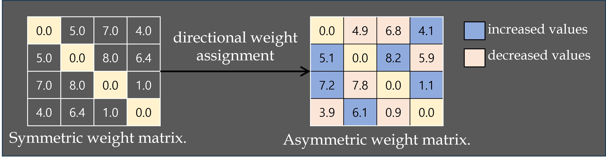

# TSC Using Directed Weighted Graphs with Temporal Dependencies
We address the problem of time series classification(TSC) in graph environments. We compute the directional weight using self-attention and lagged correlation(LC). First, WholeLC utilizes LC values from the whole sequence to capture long-term trend. Second, SubLC aggregates LC values from sliding window-based subsequences to capture local patterns. Third, SAscore leverages self-attention to measure asymmetric influences between time series by capturing global interactions and nonlinear dependencies. 



## License

This project is licensed under the MIT License.  
This project also includes code from Daochen Zha’s implementation (MIT License, 2022).
See the LICENSE file for details.

## Installation
Please use both Python 3.6 and Python 3.8
```
pip3 install -r requirements.txt
```

## Datasets
We provide the example dataset **Coffee** in this repository. You may download the full UCR datasets [here](https://www.cs.ucr.edu/~eamonn/time_series_data_2018/).

## Quick Start
We use **Coffee** as an example to demonstrate how to run the code. You may easily try other datasets with arguments `--dataset`. We will show how to obtain the results for SimTSC, WholeLC, SubLC, and SAscore.

First, prepare the dataset with (the generated dataset is already available in this repository)
```
python3.6 create_dataset.py
```

Second, compute the dtw matrix for **Coffee** (the dtw matrix is already available in this repository). We used the pydtw implementation from https://github.com/daochenzha/pydtw.git, and we extended it by adding lagged correlation(LC) and self-attention computation features.
```
python3.6 create_dtw.py
```

Third, compute the LC matrix for **Coffee** (the LC matrix is already available in this repository)
```
python3.6 LC_create.py
```

Fourth, compute the LC matrix for subsequence of  **Coffee** (the subsequence LC matrix is already available in this repository)
```
python3.6 LC_create_subsequence.py
```

Fifth, compute the self-attention of  **Coffee** (the self-attention matrix is already available in this repository)
```
python3.6 SA_create.py
```

### Run Each Model
1. For SimTSC:
```
python3.8 train_simtsc.py
```

2. For WholeLC:
```
python3.8 WholeLC.py
```

3. For SubLC:
```
python3.8 SubLC.py
```

4. For self-attention:
```
python3.8 SAscore.py
```

All the logs will be saved in `logs/`
```

## Descriptions of the Files

1. `create_dataset.py` is a script to pre-process dataset and save them into npy. Some important hyperparameters are as follows.
*   `--dataset`: what dataset to process
*   `--shot`: how many training labels are given in each class

2. `create_dtw.py` is a script to calculate pair-wise DTW distances of a dataset and save them into npy. Main hyperparameters:
*   `--dataset`: what dataset to process

3. `LC_create.py` is a script to calculate pair-wise LC values of a dataset and save them into npy. Main hyperparameters:
*   `--dataset`: what dataset to process

4. `LC_create_subsequence.py` is a script to calculate pair-wise LC values for subsequences of a dataset and save them into npy. Main hyperparameters:
*   `--dataset`: what dataset to process
*   `--w`: window size

5. `SA_create.py` is a script to calculate self-attention of a dataset and save them into npy. Main hyperparameters:
*   `--dataset`: what dataset to process

6. `train_simtsc.py` is a script to do classification of a dataset with SimTSC. Main hyperparameters:
*   `--dataset`: what dataset we operate on
*   `--shot`: how many training labels are given in each class
*   `--gpu`: which GPU to use
*   `--K`: number of neighbors per node in the constructed graph
*   `--alpha`: the scaling factor of the weights of the constructed graph
*   `--batch`: mini-batch size
*   `--epoch`: # of epochs

7. `WholeLC.py` is a script to do classification of a dataset with WholeLC. Main hyperparameters:
*   `--dataset`: what dataset we operate on
*   `--shot`: how many training labels are given in each class
*   `--gpu`: which GPU to use
*   `--K`: number of neighbors per node in the constructed graph
*   `--alpha`: the scaling factor of the weights of the constructed graph
*   `--batch`: mini-batch size
*   `--epoch`: # of epochs

8. `SubLC.py` is a script to do classification of a dataset with SubLC. Main hyperparameters:
*   `--dataset`: what dataset we operate on
*   `--shot`: how many training labels are given in each class
*   `--gpu`: which GPU to use
*   `--K`: number of neighbors per node in the constructed graph
*   `--alpha`: the scaling factor of the weights of the constructed graph
*   `--batch`: mini-batch size
*   `--epoch`: # of epochs

9. `SAscore.py` is a script to do classification of a dataset with SAscore. Main hyperparameters:
*   `--dataset`: what dataset we operate on
*   `--shot`: how many training labels are given in each class
*   `--gpu`: which GPU to use
*   `--K`: number of neighbors per node in the constructed graph
*   `--alpha`: the scaling factor of the weights of the constructed graph
*   `--batch`: mini-batch size
*   `--epoch`: # of epochs
